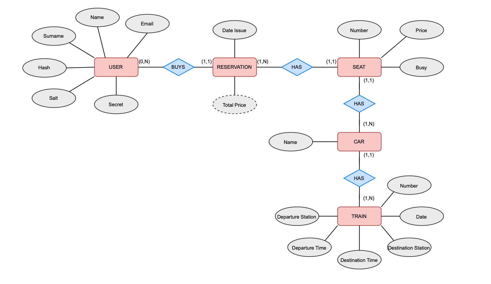
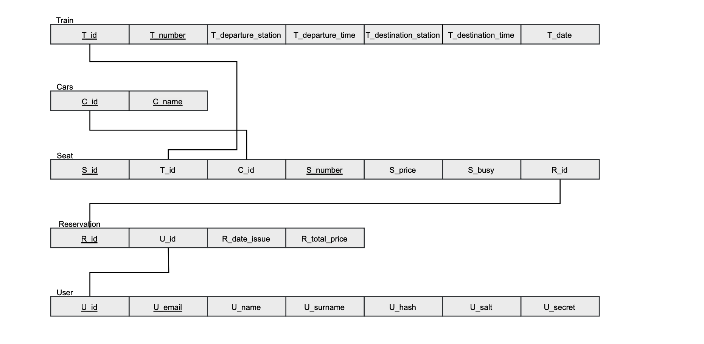
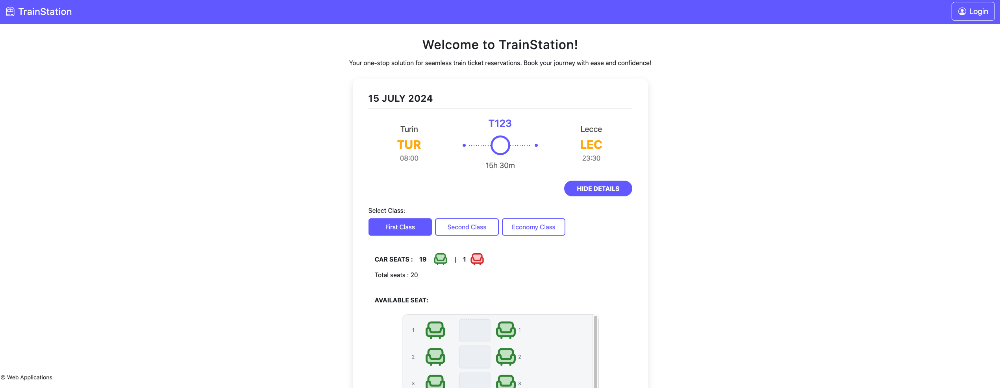
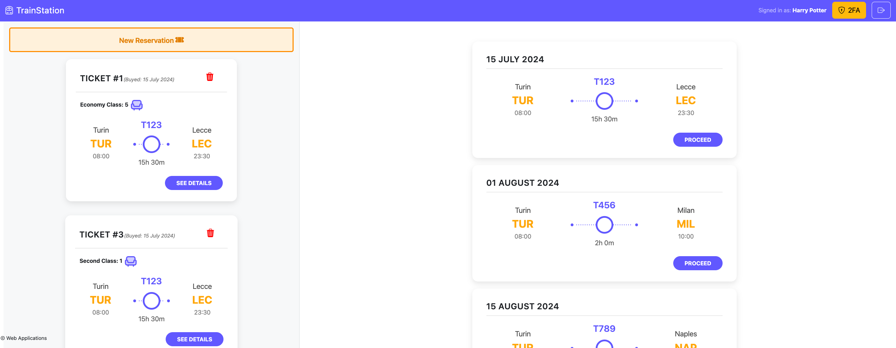
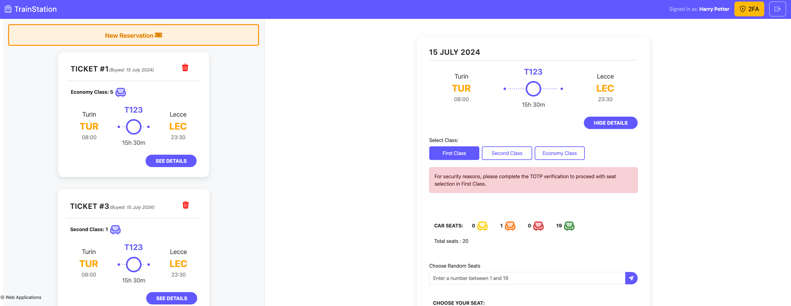
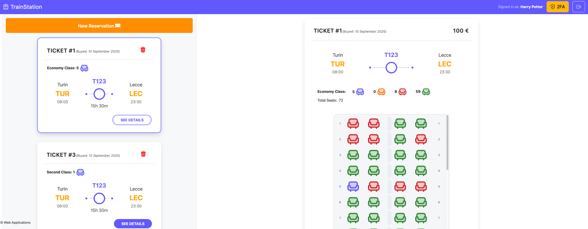

[](https://classroom.github.com/a/010GyyLK)
# Exam #3: "Train"
## Student: s348714 RIZZO MATTEO

## React Client Application Routes

- **Route `/`:** represents the public home page of the application. Upon accessing this page, users are presented with a complete list of all available trains, including basic information such as train number, departure and arrival stations, and scheduled times. From this view, users can choose to explore further details about any specific train.
When a user clicks on the "Proceed" button associated with a train, the application transitions to a seat selection interface, where the seating layout is displayed and divided into three different classes: First Class, Second Class, and Economy Class. Each seat is visually represented and color, coded to indicate its availability status, green for available seats and red for those already occupied. No authentication or login is required to view the list of trains or their seating availability.

- **Route /login:** route provides access to the user authentication interface. It includes a standard login form where username and passwd is required. Also Two-Factor Authentication (2FA) is enabled for users, to perform a reservation in 1 class.

- **Route `/my-reservations`:** After a successful login, the user is redirected to this page, which is structured into two main sections. On the left side, there is a "New Reservation" button, followed by a list of all the user's existing tickets. On the right side, the "New Reservation" section is active by default, allowing the user to browse available trains and proceed with booking a new ticket. Alternatively, the user can select one of the tickets listed on the left side to view its details. Once a ticket is selected, the right side of the page dynamically updates to display all relevant information about that reservation, including train details, selected seats, and travel class.
---
## API Server

- POST `http://localhost:3001/api/sessions`
  - description: User Login
  - request parameters headers and request body content
    ```json
    content-type: application/json

    {
      "username": "harry@test.com",
      "password": "pwd"
    }
    ```
  - response body content
    ```json
    {
      "id": 1,
      "name": "Harry",
      "surname": "Potter",
      "canDoTotp": true,
      "isTotp": false
    }
    ```
- POST `http://localhost:3001/api/login-totp`
  - description: Login with OTP code.
  - request parameters headers and request body content
    ```json
    content-type: application/json

    {
      "code": "623560"
    }
    ```
  - response body content
    ```json
    {
      "otp": "authorized"
    }
    ```

- GET `http://localhost:3001/api/trains`
  - description: Get list of all trains.
  - request parameters headers and request body content
    ```json
    content-type: application/json
    ```
  - response body content
    ```json
    [
      {
        "id": 1,
        "trainNumber": "T123",
        "departureStation": "Turin",
        "departureTime": "2024-07-15 08:00:00",
        "arrivalStation": "Lecce",
        "arrivalTime": "2024-07-15 23:30:00",
        "date": "2024-07-15"
      },
      {
        "id": 2,
        "trainNumber": "T456",
        "departureStation": "Turin",
        "departureTime": "2024-08-01 08:00:00",
        "arrivalStation": "Milan",
        "arrivalTime": "2024-08-01 10:00:00",
        "date": "2024-08-01"
      },
      {
        "id": 3,
        "trainNumber": "T789",
        "departureStation": "Turin",
        "departureTime": "2024-08-15 08:00:00",
        "arrivalStation": "Naples",
        "arrivalTime": "2024-08-15 10:00:00",
        "date": "2024-08-15"
      }
    ]
    ```
- GET `http://localhost:3001/api/trains/:idTrain/cars`
  - description: Get list of all cars for a specific train(No Login).
  - request parameters headers and request body content

    ```json
    content-type: application/json
    params: 
      [
        "idTrain": "A valid Integer number for train" 
      ]
    ```
  - response body content
    ```json
    [
      {
        "idCar": 1,
        "carName": "first class",
        "trainId": 1
      },
      {
        "idCar": 2,
        "carName": "second class",
        "trainId": 1
      },
      {
        "idCar": 3,
        "carName": "economy class",
        "trainId": 1
      }
    ]
    ```
- GET ` http://localhost:3001/api/trains/:idTrain/cars/:idCar/seats`
  - description: Get list of seat info by trainId and carId(No Login).
  - request parameters headers and request body content
    ```json
    content-type: application/json
    params: 
      [
        "idTrain": "A valid Integer number for train" 
        "idCar": "A valid Integer number for car"
      ]
    ```
  - response body content
    ```json
    [
      {
        "idSeat": 1,
        "seatNumber": "1A",
        "trainId": 1,
        "carId": 1,
        "isBooked": true
      },
      {
        "idSeat": 2,
        "seatNumber": "1B",
        "trainId": 1,
        "carId": 1,
        "isBooked": true
      },
      {
        "idSeat": 3,
        "seatNumber": "2A",
        "trainId": 1,
        "carId": 1,
        "isBooked": false
      },
      {
        "idSeat": 4,
        "seatNumber": "2B",
        "trainId": 1,
        "carId": 1,
        "isBooked": false
      },
      {
        "idSeat": 5,
        "seatNumber": "3A",
        "trainId": 1,
        "carId": 1,
        "isBooked": true
      },
      {
        "idSeat": 6,
        "seatNumber": "3B",
        "trainId": 1,
        "carId": 1,
        "isBooked": false
      },
      {
        "idSeat": 7,
        "seatNumber": "4A",
        "trainId": 1,
        "carId": 1,
        "isBooked": false
      },
      {
        "idSeat": 8,
        "seatNumber": "4B",
        "trainId": 1,
        "carId": 1,
        "isBooked": false
      },
      ...
    ]
    ```
- GET `http://localhost:3001/api/reservations`
  - description: Get reservation list for the logged-in user.
  - request parameters headers and request body content
    ```json
    content-type: application/json
    credential
    ```
  - response body content
    ```json
    [
      {
        "reservationId": 4,
        "dateIssued": "2024-06-23",
        "totalPrice": 50,
        "seatCount": 1,
        "trainId": 1,
        "trainNumber": "T123",
        "departureStation": "Turin",
        "departureTime": "2024-07-15 08:00:00",
        "arrivalStation": "Lecce",
        "arrivalTime": "2024-07-15 23:30:00",
        "trainDate": "2024-07-15",
        "carId": 1,
        "carName": "first class"
      },
      {
        "reservationId": 5,
        "dateIssued": "2024-06-24",
        "totalPrice": 40,
        "seatCount": 2,
        "trainId": 1,
        "trainNumber": "T123",
        "departureStation": "Turin",
        "departureTime": "2024-07-15 08:00:00",
        "arrivalStation": "Lecce",
        "arrivalTime": "2024-07-15 23:30:00",
        "trainDate": "2024-07-15",
        "carId": 3,
        "carName": "economy class"
      }
    ]
    ```
- GET `http://localhost:3001/api/reservations/trains/:idTrain/cars/:idCar/seats`
  - description: Get list of seat info by trainId and carId(Logged in).
  - request parameters headers and request body content
    ```json
    content-type: application/json
    credential
    params: 
      [
        "idTrain": "A valid Integer number for train" 
        "idCar": "A valid Integer number for car"
      ]
    
    ```
  - response body content
    ```json
    [
      {
        "seatId": 66,
        "seatNumber": "1A",
        "seatPrice": 20,
        "seatStatus": "orange"
      },
      {
        "seatId": 67,
        "seatNumber": "1B",
        "seatPrice": 20,
        "seatStatus": "orange"
      },
      {
        "seatId": 68,
        "seatNumber": "1C",
        "seatPrice": 20,
        "seatStatus": "green"
      },
      {
        "seatId": 69,
        "seatNumber": "1D",
        "seatPrice": 20,
        "seatStatus": "green"
      },
      ...
    ] 
    ```
- GET `http://localhost:3001/api/reservations/:idReservation`
  - description: Get reservation info by reservationId for the logged-in user.
  - request parameters headers and request body content
    ```json
    content-type: application/json
    credential
    params: 
      [
        "idReservation": "A valid Integer number for reservation" 
      ]
    ```
  - response body content
    ```json
    {
        "reservationId": 4,
        "dateIssued": "2024-06-23",
        "totalPrice": 50,
        "trainId": 1,
        "trainNumber": "T123",
        "departureStation": "Turin",
        "departureTime": "2024-07-15 08:00:00",
        "arrivalStation": "Lecce",
        "arrivalTime": "2024-07-15 23:30:00",
        "trainDate": "2024-07-15",
        "carId": 1,
        "carName": "first class",
        "purpleSeats": 1,
        "orangeSeats": 3,
        "redSeats": 0,
        "greenSeats": 16,
        "seats": [
          {
            "seatId": 1,
            "seatNumber": "1A",
            "seatPrice": 50,
            "seatStatus": "orange"
          },
          {
            "seatId": 2,
            "seatNumber": "1B",
            "seatPrice": 50,
            "seatStatus": "orange"
          },
          {
            "seatId": 3,
            "seatNumber": "2A",
            "seatPrice": 50,
            "seatStatus": "green"
          }, 
          ...
        ]
    }
    ```
- POST `http://localhost:3001/api/reservations`
  - description: Create a new reservation for the logged-in user.
  - request parameters headers and request body content
    ```json
    content-type: application/json
    credential
    {
      "trainId": 1,
      "carId": 3,
      "seatIds": [80, 85]
    }
    ```
  - response body content
    ```json
    {
      "reservationId": {
        "type": "successfully_created",
        "data": {
          "reservationId": 82,
          "totalPrice": 40,
          "trainId": 1,
          "carId": 3,
          "seatBooked": [
            {
              "seatId": 80,
              "seatNumber": "4C",
              "price": 20
            },
            {
              "seatId": 85,
              "seatNumber": "5D",
              "price": 20
            }
          ]
        }
      }
    }
    ```
- DELETE `http://localhost:3001/api/reservations/:idReservation`
  - description: Delete a reservation by reservationId for the logged-in user.
  - request parameters headers and request body content
    ```json
    content-type: application/json
    credential
    params: 
      [
        "idReservation": "A valid Integer number for reservation" 
      ]
    ```
  - response body content
    ```json
    HTTP/1.1 204 No Content
    ```

---

## Database Tables



- Table `users`:
  ```sql
  (
    "id"	        INTEGER PRIMARY KEY AUTOINCREMENT,
    "email"	        TEXT NOT NULL UNIQUE,
    "name"	        TEXT NOT NULL,
    "surname"	    TEXT NOT NULL,
    "hash"	        TEXT,
    "salt"	        TEXT,
    "secret"	    TEXT
  );
  ```
- Table `trains`:
  ```sql
  (
    "id"	            INTEGER PRIMARY KEY AUTOINCREMENT,
    "trainNumber"	    TEXT NOT NULL UNIQUE,
    "departureStation"	TEXT NOT NULL,
    "departureTime"	    DATE NOT NULL,
    "arrivalStation"	TEXT NOT NULL,
    "arrivalTime"	    DATE NOT NULL,
    "date"	            DATE NOT NULL
  );

  ```
- Table `cars`:
  ```sql
  (
    "id"	            INTEGER PRIMARY KEY AUTOINCREMENT,
    "carName"	        TEXT NOT NULL UNIQUE
  );
  ``` 
- Table `seats`:
  ```sql
  (
    "id"	INTEGER PRIMARY KEY AUTOINCREMENT,
    "seatNumber"	TEXT NOT NULL,
    "price"	REAL NOT NULL CHECK("price" > 0),
    "isBusy"	INTEGER DEFAULT 0 CHECK("isBusy" IN (0,1)),
    "trainId"	INTEGER NOT NULL,
    "carId"	    INTEGER NOT NULL,
    "reservationId" INTEGER,
    FOREIGN KEY("trainId") REFERENCES "trains"("id"),
    FOREIGN KEY("carId") REFERENCES "cars"("id"),
    FOREIGN KEY("reservationId") REFERENCES "reservations"("id")
    UNIQUE(trainId, carId, seatNumber)
  ); 
  

  ```
- Table `reservations`:
  ```sql
  (
    "id"	        INTEGER PRIMARY KEY AUTOINCREMENT,
    "dateIssued"	DATE NOT NULL,
    "totalPrice"	REAL NOT NULL CHECK("totalPrice" >= 0),
    "userId"	    INTEGER NOT NULL,
    FOREIGN KEY("userId") REFERENCES "users"("id")
  );
  

  ``` 


## Main React Components

- `App.jsx` Root component, maintains global state, handles login/logout, routing.
- `TrainsRouteComponents.jsx`: show the list of trains and their details. 
- `ReservationsRouteComponents.jsx`: manage the right and left part of the page. 
- `ReservationRightSidePageComponents.jsx`: manage right part of the page: new reservation details and old reservation details.
- `ReservationLeftSidePageComponents.jsx`: manage left part of the page: new reservation button and list of reservation.
- `ConfirmModalNewReservationComponents.jsx`: Modal to summarize the info for a new reservation.

(only _main_ components, minor ones may be skipped)

## Screenshot






## Users Credentials

- email: harry@test.com,    passwd: pwd, otp: LXBSMDTMSP2I5XFXIYRGFVWSFI [ a reservation in each one of the classes] 
- email: ron@test.com,      passwd: pwd, otp: LXBSMDTMSP2I5XFXIYRGFVWSFI [ 2 reservations in the same class] 
- email: hermione@test.com, passwd: pwd, otp: LXBSMDTMSP2I5XFXIYRGFVWSFI [ 2 reservations in different class] 
- email: lord@test.com,     passwd: pwd, otp: LXBSMDTMSP2I5XFXIYRGFVWSFI [ no reservations]

## Script to generate password:

node -e "const crypto=require('crypto'); const password='pwd'; const salt=crypto.randomBytes(16).toString('hex'); crypto.scrypt(password,salt,32,(err,hash)=>{if(err)throw err; console.log('Password:',password); console.log('Salt:',salt); console.log('Hash:',hash.toString('hex'));});"

